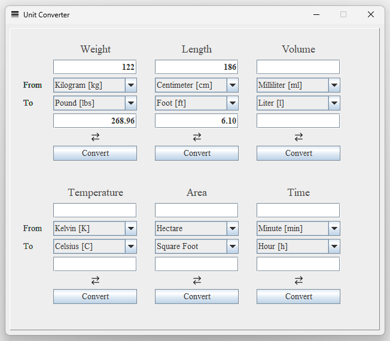

# Unit Converter
- Converts the most popular unit types using `Swing`, Java's buit in, GUI library.

    

 

    

 

## Requirements
### Java - used: 17
- https://www.oracle.com/java/technologies/downloads/

## Thank you all who worked on the modules used in this project!